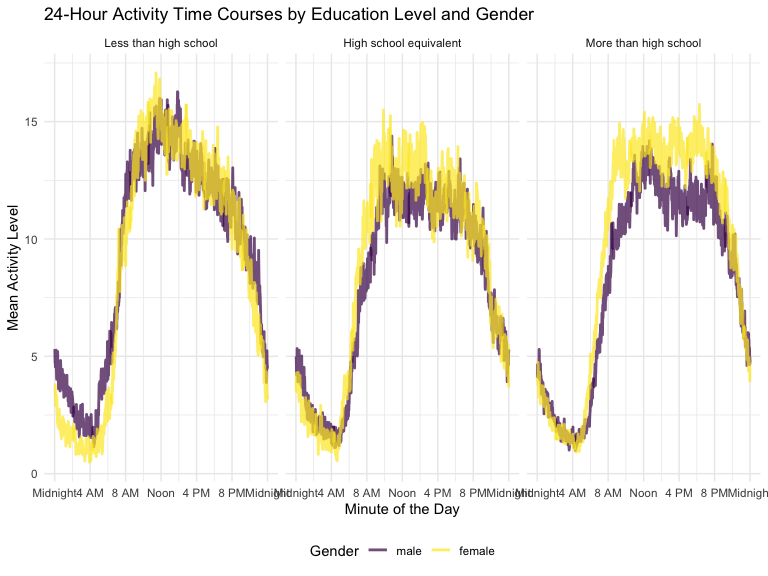

p8105_hw3_yl5505
================
Yan Li
2024-10-11

``` r
library(p8105.datasets)
data("ny_noaa")
```

# Problem 1

## Overview

``` r
ny_noaa
```

    ## # A tibble: 2,595,176 × 7
    ##    id          date        prcp  snow  snwd tmax  tmin 
    ##    <chr>       <date>     <int> <int> <int> <chr> <chr>
    ##  1 US1NYAB0001 2007-11-01    NA    NA    NA <NA>  <NA> 
    ##  2 US1NYAB0001 2007-11-02    NA    NA    NA <NA>  <NA> 
    ##  3 US1NYAB0001 2007-11-03    NA    NA    NA <NA>  <NA> 
    ##  4 US1NYAB0001 2007-11-04    NA    NA    NA <NA>  <NA> 
    ##  5 US1NYAB0001 2007-11-05    NA    NA    NA <NA>  <NA> 
    ##  6 US1NYAB0001 2007-11-06    NA    NA    NA <NA>  <NA> 
    ##  7 US1NYAB0001 2007-11-07    NA    NA    NA <NA>  <NA> 
    ##  8 US1NYAB0001 2007-11-08    NA    NA    NA <NA>  <NA> 
    ##  9 US1NYAB0001 2007-11-09    NA    NA    NA <NA>  <NA> 
    ## 10 US1NYAB0001 2007-11-10    NA    NA    NA <NA>  <NA> 
    ## # ℹ 2,595,166 more rows

``` r
summarize(ny_noaa, rows = n(), columns = ncol(ny_noaa))
```

    ## # A tibble: 1 × 2
    ##      rows columns
    ##     <int>   <int>
    ## 1 2595176       7

``` r
summarize(ny_noaa, across(everything(), ~mean(is.na(.))))
```

    ## # A tibble: 1 × 7
    ##      id  date   prcp  snow  snwd  tmax  tmin
    ##   <dbl> <dbl>  <dbl> <dbl> <dbl> <dbl> <dbl>
    ## 1     0     0 0.0562 0.147 0.228 0.437 0.437

– This dataset is a weather dataset, it has 2595176 rows and 7
variables - `id`: Weather station ID - `date`: Date of observation -
`prcp`: Precipitation (tenths of mm) - `snow`: Snowfall (mm) - `snwd`:
Snow depth (mm) - `tmax`: Maximum temperature (tenths of degrees C) -
`tmin`: Minimum temperature (tenths of degrees C) – There are many
columns with missing data. tmax and tmin have about 44% data missing,
snow has 15%, and snwd has 23%. Missing data could cause bias or make
the dataset less reliable for certain analyses.

## Data cleaning

- create new variables

``` r
noaa_cleaned = ny_noaa |>
  mutate(
    year = as.numeric(format(date, "%Y")),
    month = as.numeric(format(date, "%m")),
    day = as.numeric(format(date, "%d"))
  )
noaa_cleaned
```

    ## # A tibble: 2,595,176 × 10
    ##    id          date        prcp  snow  snwd tmax  tmin   year month   day
    ##    <chr>       <date>     <int> <int> <int> <chr> <chr> <dbl> <dbl> <dbl>
    ##  1 US1NYAB0001 2007-11-01    NA    NA    NA <NA>  <NA>   2007    11     1
    ##  2 US1NYAB0001 2007-11-02    NA    NA    NA <NA>  <NA>   2007    11     2
    ##  3 US1NYAB0001 2007-11-03    NA    NA    NA <NA>  <NA>   2007    11     3
    ##  4 US1NYAB0001 2007-11-04    NA    NA    NA <NA>  <NA>   2007    11     4
    ##  5 US1NYAB0001 2007-11-05    NA    NA    NA <NA>  <NA>   2007    11     5
    ##  6 US1NYAB0001 2007-11-06    NA    NA    NA <NA>  <NA>   2007    11     6
    ##  7 US1NYAB0001 2007-11-07    NA    NA    NA <NA>  <NA>   2007    11     7
    ##  8 US1NYAB0001 2007-11-08    NA    NA    NA <NA>  <NA>   2007    11     8
    ##  9 US1NYAB0001 2007-11-09    NA    NA    NA <NA>  <NA>   2007    11     9
    ## 10 US1NYAB0001 2007-11-10    NA    NA    NA <NA>  <NA>   2007    11    10
    ## # ℹ 2,595,166 more rows

- unit conversion

``` r
noaa_cleaned = ny_noaa |>
  mutate(
     tmax = as.numeric(tmax) / 10,
    tmin = as.numeric(tmin) / 10,
    prcp = as.numeric(prcp) / 10
  )
noaa_cleaned
```

    ## # A tibble: 2,595,176 × 7
    ##    id          date        prcp  snow  snwd  tmax  tmin
    ##    <chr>       <date>     <dbl> <int> <int> <dbl> <dbl>
    ##  1 US1NYAB0001 2007-11-01    NA    NA    NA    NA    NA
    ##  2 US1NYAB0001 2007-11-02    NA    NA    NA    NA    NA
    ##  3 US1NYAB0001 2007-11-03    NA    NA    NA    NA    NA
    ##  4 US1NYAB0001 2007-11-04    NA    NA    NA    NA    NA
    ##  5 US1NYAB0001 2007-11-05    NA    NA    NA    NA    NA
    ##  6 US1NYAB0001 2007-11-06    NA    NA    NA    NA    NA
    ##  7 US1NYAB0001 2007-11-07    NA    NA    NA    NA    NA
    ##  8 US1NYAB0001 2007-11-08    NA    NA    NA    NA    NA
    ##  9 US1NYAB0001 2007-11-09    NA    NA    NA    NA    NA
    ## 10 US1NYAB0001 2007-11-10    NA    NA    NA    NA    NA
    ## # ℹ 2,595,166 more rows

- most common snowfall value

``` r
noaa_cleaned = ny_noaa |>
  count(snow) |>
  arrange(desc(n))

noaa_cleaned
```

    ## # A tibble: 282 × 2
    ##     snow       n
    ##    <int>   <int>
    ##  1     0 2008508
    ##  2    NA  381221
    ##  3    25   31022
    ##  4    13   23095
    ##  5    51   18274
    ##  6    76   10173
    ##  7     8    9962
    ##  8     5    9748
    ##  9    38    9197
    ## 10     3    8790
    ## # ℹ 272 more rows

– The most commonly observed snowfall value is 0 mm, it mean that on
most days there was no snowfall recorded. It is reasonable becasue New
York does not snow a lot considering its location and geography.

## Two-panel plot

\#Problem 2

``` r
hw_covar = read_csv("nhanes_covar.csv",skip = 4 )|>
  janitor::clean_names()
```

    ## Rows: 250 Columns: 5
    ## ── Column specification ────────────────────────────────────────────────────────
    ## Delimiter: ","
    ## dbl (5): SEQN, sex, age, BMI, education
    ## 
    ## ℹ Use `spec()` to retrieve the full column specification for this data.
    ## ℹ Specify the column types or set `show_col_types = FALSE` to quiet this message.

``` r
hw_accel = read_csv("nhanes_accel.csv")|>
  janitor::clean_names()
```

    ## Rows: 250 Columns: 1441
    ## ── Column specification ────────────────────────────────────────────────────────
    ## Delimiter: ","
    ## dbl (1441): SEQN, min1, min2, min3, min4, min5, min6, min7, min8, min9, min1...
    ## 
    ## ℹ Use `spec()` to retrieve the full column specification for this data.
    ## ℹ Specify the column types or set `show_col_types = FALSE` to quiet this message.

- merge two dataset

``` r
hw_ac = inner_join(hw_accel, hw_covar, by = "seqn")
hw_ac
```

    ## # A tibble: 250 × 1,445
    ##     seqn  min1  min2  min3  min4   min5   min6  min7   min8    min9  min10
    ##    <dbl> <dbl> <dbl> <dbl> <dbl>  <dbl>  <dbl> <dbl>  <dbl>   <dbl>  <dbl>
    ##  1 62161 1.11  3.12  1.47  0.938 1.60   0.145  2.10  0.509   1.63   1.20  
    ##  2 62164 1.92  1.67  2.38  0.935 2.59   5.22   2.39  4.90    1.97   3.13  
    ##  3 62169 5.85  5.18  4.76  6.48  6.85   7.24   6.12  7.48    5.47   6.49  
    ##  4 62174 5.42  3.48  3.72  3.81  6.85   4.45   0.561 1.61    0.698  2.72  
    ##  5 62177 6.14  8.06  9.99  6.60  4.57   2.78   7.10  7.25   10.1    7.49  
    ##  6 62178 0.167 0.429 0.131 1.20  0.0796 0.0487 0.106 0.0653  0.0564 0.0639
    ##  7 62180 0.039 0     0     0     0.369  0.265  0.506 0.638   0      0.011 
    ##  8 62184 1.55  2.81  3.86  4.76  6.10   7.61   4.74  6.73    5.42   4.24  
    ##  9 62186 3.08  2.54  2.63  2.12  1.14   1.68   2.84  2.72    2.13   2.18  
    ## 10 62189 2.81  0.195 0.163 0     0.144  0.180  0.870 0.214   0      0     
    ## # ℹ 240 more rows
    ## # ℹ 1,434 more variables: min11 <dbl>, min12 <dbl>, min13 <dbl>, min14 <dbl>,
    ## #   min15 <dbl>, min16 <dbl>, min17 <dbl>, min18 <dbl>, min19 <dbl>,
    ## #   min20 <dbl>, min21 <dbl>, min22 <dbl>, min23 <dbl>, min24 <dbl>,
    ## #   min25 <dbl>, min26 <dbl>, min27 <dbl>, min28 <dbl>, min29 <dbl>,
    ## #   min30 <dbl>, min31 <dbl>, min32 <dbl>, min33 <dbl>, min34 <dbl>,
    ## #   min35 <dbl>, min36 <dbl>, min37 <dbl>, min38 <dbl>, min39 <dbl>, …

``` r
ac_clean = hw_ac |>
  filter(age >= 21) |>
  drop_na()|>
  mutate(
    sex = factor(sex, levels = c(1, 2), labels = c("male", "female")),
    education = factor(education, levels = c(1, 2, 3), labels = c("Less than high school", "High school equivalent", "More than high school"))
  )
```

## create table for the number of men and women in each education category

``` r
edu_table = ac_clean |>
  group_by(education, sex) |>
  summarize(count = n(), .groups = "drop") |>
  pivot_wider(names_from = sex, values_from = count, values_fill = 0)

edu_table|>kable()
```

| education              | male | female |
|:-----------------------|-----:|-------:|
| Less than high school  |   27 |     28 |
| High school equivalent |   35 |     23 |
| More than high school  |   56 |     59 |

## create plot

``` r
ggplot(ac_clean, aes(x = education, y = age, fill = sex)) +
  geom_boxplot(alpha = 0.7) +
  scale_fill_manual(values = c("male" = "#1f77b4", "female" = "#ff7f0e")) +
  labs(
    title = "Age Distribution by Education Level and Gender",
    x = "Education Level",
    y = "Age",
    fill = "Gender"
  )
```

 -
The table shows the gender distribution across education levels,and the
“High school equivalent” group has fewer females compared to males. -
The boxplot shows that, in “More than high school”, the age distribution
is more concentrated, with a visible peak in the 40-45 age range for
both men and women. - Greater variability in age for males across all
education levels.

## Total activity Plot

``` r
ac_clean |>
  pivot_longer(
    min1:min1440,
    names_to = "mim_min",
    names_prefix = "min",
    values_to = "mims_value"
  ) |>
  group_by(seqn, sex, age, education) |>
  summarize(total = sum(mims_value, na.rm = TRUE)) |>
  ggplot(aes(x = age, y = total, color = sex)) +
  geom_point(ahpha = 0.5) +
  geom_smooth (se = FALSE) +
  facet_wrap(~ education) + 
  labs(
    title = "Total Daily Activity vs Age by Education Level and Gender",
    x = "Age",
    y = "Total Daily Activity"
  ) 
```

    ## `summarise()` has grouped output by 'seqn', 'sex', 'age'. You can override
    ## using the `.groups` argument.
    ## `geom_smooth()` using method = 'loess' and formula = 'y ~ x'


